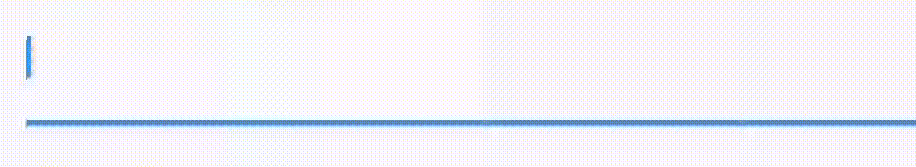
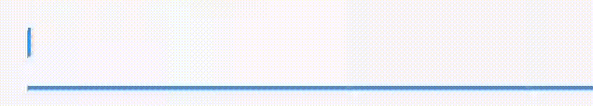

<!--
This README describes the package. If you publish this package to pub.dev,
this README's contents appear on the landing page for your package.

For information about how to write a good package README, see the guide for
[writing package pages](https://dart.dev/guides/libraries/writing-package-pages).

For general information about developing packages, see the Dart guide for
[creating packages](https://dart.dev/guides/libraries/create-library-packages)
and the Flutter guide for
[developing packages and plugins](https://flutter.dev/developing-packages).
-->


A Textfield provides you with a textfield which provides automatic fomating of date time
`Date_format_field` provides a text field


## Features
This textfield supports four date time formating options:

Type 1


Type 2


Type 3



Type 4




## Usage

1. Install the package by adding the following in your `pubspec.yaml` file
```
date_time_formater: latest_version
```
2. Add this field to your widget screen using 
```
import 'package:date_format_field/date_format_field.dart';

DateFormatField(
    type: DateFormatType.type4,
)
```

*Add Styling* 

The widget makes use of `InputDecorator` which is the same as the default styling supported by flutter

example:

```
DateFormatField(
    type: DateFormatType.type4,
    decoration: InputDecoration(
        hintText: 'DD/MM/YY',
        border: InputBorder.none,
        icon: Icon(Icons.calendar_month)
    ),
)
```


## Usage

TODO: Include short and useful examples for package users. Add longer examples
to `/example` folder.

```dart
const like = 'sample';
```


## Additional information

TODO: Tell users more about the package: where to find more information, how to
contribute to the package, how to file issues, what response they can expect
from the package authors, and more.
